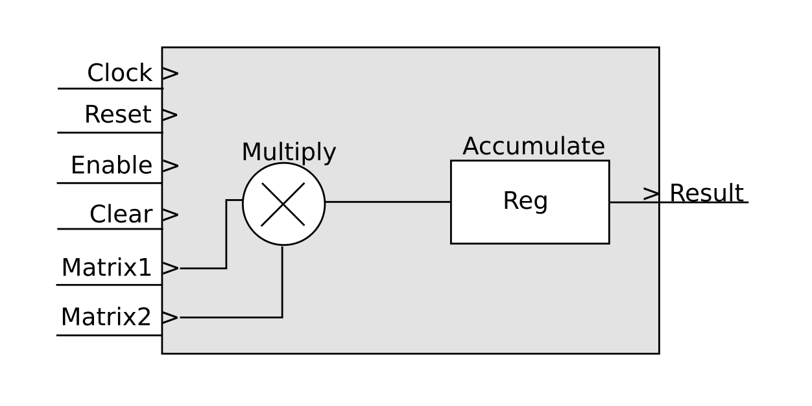

# Matrix-MAC-Unit

Matrix MAC unit is 8-bit Multiply and Accumulate core for 4 X 4 size matrixes.



## Usage

Generally MAC units are the base of DSP's like FIR filters.

However to do calculus of Convolutional Neural Networks(CNNs), the matrix ability has to be added to the design.

The design supports 4 X 4 size matrixes that are standard size in deep neural network. The reason why the design is 8-bit is that for deep learning computation hardware needs to be 8-bit in width at least. Bit width can be changd by changing the number 8 in code for anything suitable.
The code is

```systemverilog
localparam DATA_WIDTH = 8
```
Matrix size can be changed by changing

```systemverilog
localparam M_SIZE = 4
```
and changing the loop and making more combinations inside the initilaization from 1D to 2D and vice-versa.
